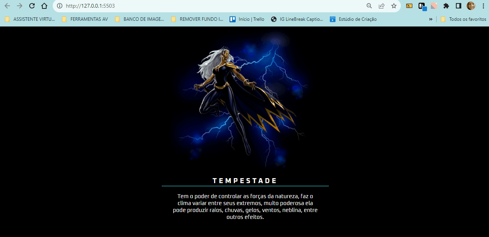

# PROJETO FIGMA X-MEN
Um projeto FIGMA X-MEX com a personagem Tempestade contendo a imagem, o nome da personagem e uma breve descrição para telas de computadores e de celulares📲💻

 

 

## Tecnologias utilizadas
- HTML
- CSS

## 📂Acesso ao projeto

**Você pode acessar o código fonte do projeto 

<https://github.com/denisero19/figma-xmen>**